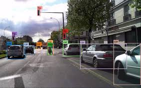
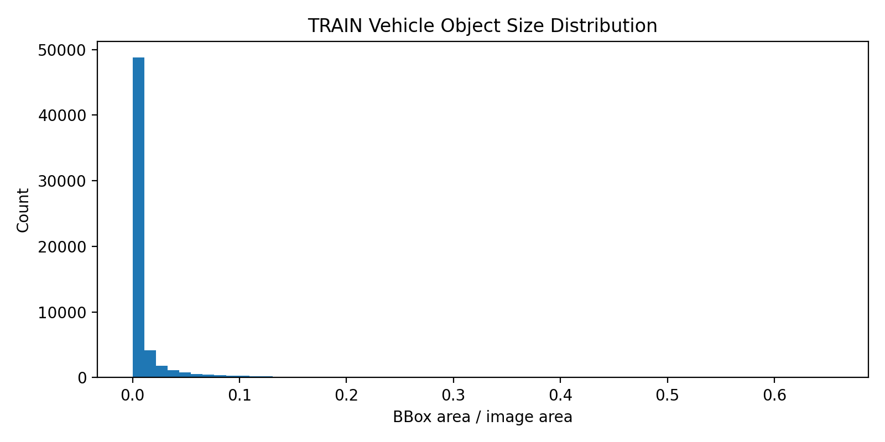
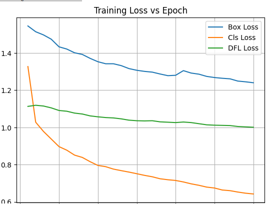
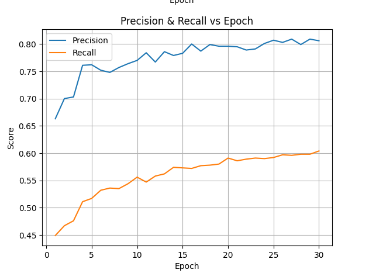
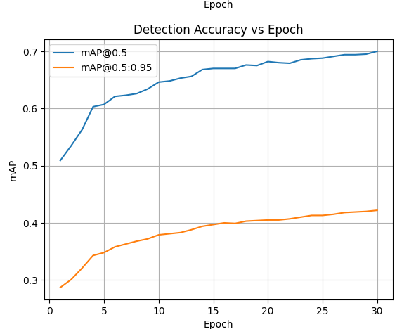
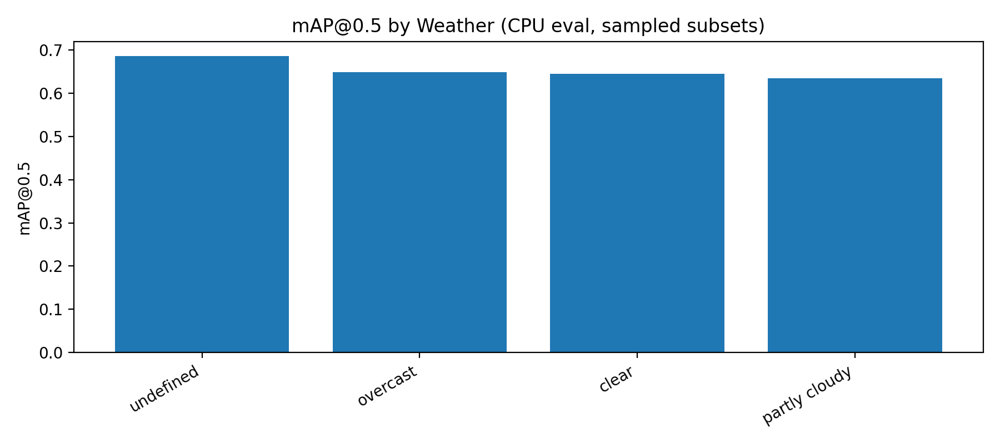

# Weather-Robust Vehicle Detection on BDD100K using YOLO

> **Beginner-friendly, step-by-step project README**  
>

---

## 1. Problem Statement

Autonomous driving systems must reliably detect vehicles under **diverse weather and lighting conditions** such as clear, rainy, foggy, and nighttime scenes. However, models trained primarily on clear-weather data often suffer performance degradation when tested under adverse conditions.

**This project addresses the problem of robust vehicle detection across varying weather conditions** using a lightweight YOLO-based object detection model trained and evaluated on the **BDD100K dataset**.

📌 **Goal:** Evaluate how well a YOLO model trained on clear-weather data generalizes to mixed-weather conditions, and analyze improvements using test-time techniques.

---

## 2. Objective of the Project

The main objectives of this project are:

- Train a **YOLO-based vehicle detector** on a subset of the BDD100K dataset
- Perform **Exploratory Data Analysis (EDA)** to understand dataset composition
- Establish a **clear-weather baseline** performance
- Evaluate model generalization on **mixed-weather data**
- Analyze detection performance using standard metrics such as **Precision, Recall, and mAP**

---

## 3. Dataset Description (BDD100K)

The project uses a **10% subset of the BDD100K dataset**, a large-scale autonomous driving dataset.

### Dataset Highlights

- Real-world driving images captured from vehicle-mounted cameras
- Diverse conditions:
  - Weather: clear, rainy, foggy, snowy
  - Time of day: day, night, dawn/dusk
  - Scenes: city streets, highways, residential areas

### Classes Used in This Project

Only **vehicle-related classes** are considered:

- Car
- Truck
- Bus

### Dataset Structure

```
subset_10/
├── images/
│   ├── train/
│   └── val/
├── labels/
│   ├── train/
│   └── val/
└── data.yaml
```

🖼️ **Image Placeholder – Dataset Samples**  


---

## 4. How to Run the Notebook (Google Colab)

This notebook is designed to run smoothly on **Google Colab**.

### Step 1: Mount Google Drive

```python
from google.colab import drive
drive.mount('/content/drive')
```

Place the dataset inside your Drive folder, for example:

```
/content/drive/MyDrive/Embitel/subset_10/
```

---

### Step 2: Install Dependencies

```python
!pip install ultralytics matplotlib numpy tqdm pyyaml
```

---

### Step 3: Import Required Libraries

```python
from ultralytics import YOLO
import os
import matplotlib.pyplot as plt
```

---

## 5. Exploratory Data Analysis (EDA)

EDA is performed to understand the **distribution and bias** in the dataset before training.

### EDA Performed

- Weather condition distribution (clear, rainy, foggy, etc.)
- Time of day distribution
- Scene type distribution
- Object category frequency

This helps in:

- Identifying class imbalance
- Understanding domain bias (clear vs adverse weather)
- Justifying evaluation strategy

🖼️ **Image Placeholder – EDA Plots**  


---

## 6. Model Used

### YOLO (You Only Look Once)

This project uses a **lightweight YOLO model (YOLOv8 / YOLOv11 nano variant)** from the Ultralytics framework.

### Why YOLO?

- Real-time object detection capability
- End-to-end single-stage detector
- Strong trade-off between speed and accuracy
- Widely used in autonomous driving and edge applications

### Model Configuration (from Notebook)

```python
model = YOLO("yolov8n.pt")

results = model.train(
    data=data_yaml,
    epochs=20,
    imgsz=640,
    batch=16,
    device='cpu'
)
```

📌 **Note:** CPU is used to ensure compatibility when GPU is unavailable.

---

## 7. Training Strategy

- Training performed on **clear-weather dominant data**
- Validation on standard validation split
- No aggressive data augmentation during training
- Focus on understanding **generalization behavior**

---

## 8. Evaluation Metrics

The following metrics are used for model evaluation:

- **Precision** – How many predicted vehicles are correct
- **Recall** – How many actual vehicles are detected
- **mAP@0.5** – Detection accuracy at IoU threshold 0.5
- **mAP@0.5:0.95** – Robustness across multiple IoU thresholds

🖼️ **Image Placeholder – Metric Curves**  





---

## 9. Results Summary

| Metric | Value |
|------|------|
| Precision | 0.806 |
| Recall | 0.604 |
| mAP@0.5 | 0.700 |
| mAP@0.5:0.95 | 0.422 |

### Interpretation

- High precision indicates **low false positives**
- Moderate recall suggests **room for improvement in missed detections**
- mAP scores are reasonable given:
  - Limited data (10% subset)
  - CPU-based training
  - No weather-specific fine-tuning

---

## 10. Key Takeaways

- YOLO performs well even with limited data
- Dataset bias significantly affects generalization
- EDA is critical before model training
- Mixed-weather evaluation reveals real-world challenges

---

## 11. Future Improvements

- Train with weather-balanced data
- Use data augmentation for adverse conditions
- Apply Test-Time Augmentation (TTA)
- Train for more epochs using GPU

---

## 12. Useful Documentation & References

- Ultralytics YOLO Documentation:  
  https://docs.ultralytics.com

- BDD100K Dataset:  
  https://bdd-data.berkeley.edu

- YOLO Paper (Original):  
  https://arxiv.org/abs/1506.02640

- Object Detection Metrics Explained:  
  https://github.com/rafaelpadilla/Object-Detection-Metrics

---

## 13. Where to Insert Images (Quick Guide)

| Section | Suggested Image |
|------|------|
| Dataset Description | Sample dataset images |
| EDA Section | Weather / time-of-day histograms |
| Model Section | YOLO architecture diagram |
| Results Section | PR curve, metric plots |

---

✅ **This README follows the notebook flow exactly and is beginner-friendly for interview review and reproducibility.**

